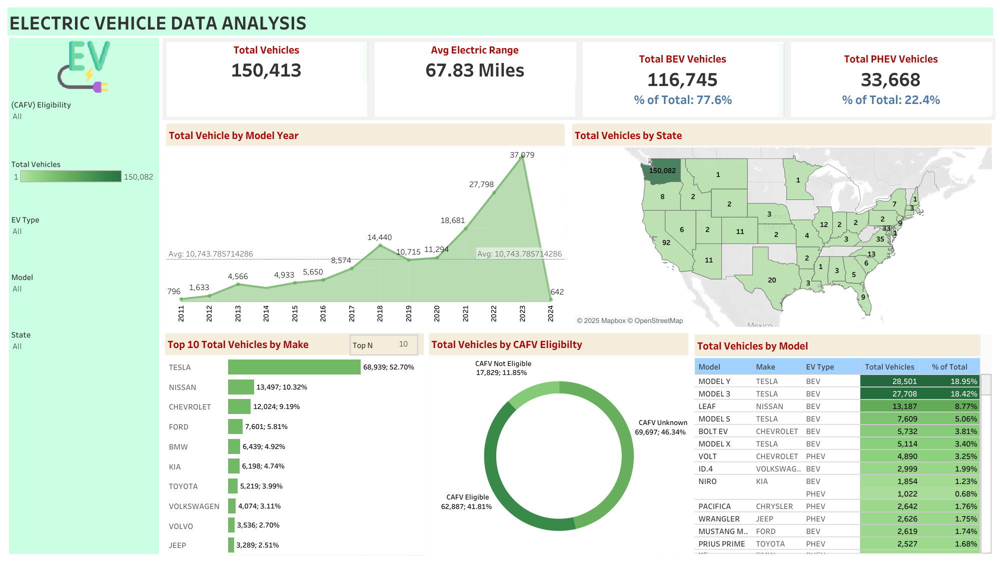

# EV-Dashboard-USA
A Tableau dashboard analyzing the electric vehicle landscape in the United States.

## 📊 Overview  
This project explores the evolving Electric Vehicle (EV) landscape in the United States using Tableau. It analyzes adoption trends, state-wise EV distribution, EV type performance, and vehicle categories. Designed with interactivity and clarity, this dashboard aims to support clean energy decisions and transportation planning.

---

## 🎯 Dashboard Highlights  
- **EV Overview**: Total EV sales, energy consumption, and year-wise growth  
- **State-wise Insights**: EV adoption patterns across various U.S. states  
- **EV Type Comparison**: Battery Electric Vehicles (BEVs) vs. Plug-in Hybrid Electric Vehicles (PHEVs)  
- **Vehicle Category Analysis**: 2-wheelers, 3-wheelers, 4-wheelers, and other categories  
- **Interactive Filters**:  
  - CAFV Eligibility  
  - EV Type (BEV, PHEV, All)  
  - Model  
  - State  
  - Total Vehicles

---

## 📌 Key KPIs  
- Total Vehicles  
- Average Electric Range  
- Total BEV Vehicles  
- Total PHEV Vehicles  

---

## 🔧 Tools Used  
- **Tableau** – Data visualization  
- **Excel** – Data cleaning & preparation  
- **Dashboard Design** – Focused on interactivity and storytelling  
- **Storytelling with Data** – For visual clarity and meaningful insights  

---

## 🔗 Live Dashboard  
👉 [Click here to view the interactive dashboard on Tableau Public](https://public.tableau.com/shared/B6TQ9JXWB?:display_count=n&:origin=viz_share_link)

---

## 🖼️ Preview  

### EV Overview  

### State-wise Analysis  

### EV Type Segmentation  

### Vehicle Category Insights  

---

## 🙌 Feedback & Contribution  
Feedback is welcome!  
Feel free to open an issue or share suggestions for improvement.

---

## 📬 Connect with Me  
[LinkedIn](https://www.linkedin.com/in/karishmaasawant)  
